# Employee Check-in/Checkout System - Architecture Document

## Table of Contents
- [Employee Check-in/Checkout System - Architecture Document](#employee-check-incheckout-system---architecture-document)
  - [Table of Contents](#table-of-contents)
  - [1. System Overview](#1-system-overview)
    - [Purpose](#purpose)
    - [Key Features](#key-features)
    - [Target Users](#target-users)
  - [2. Technology Stack](#2-technology-stack)
    - [Core Framework](#core-framework)
    - [Database](#database)
    - [Data Processing](#data-processing)
    - [Date/Time Handling](#datetime-handling)
    - [Security](#security)
    - [Utilities](#utilities)
  - [3. System Architecture](#3-system-architecture)
    - [High-Level Architecture](#high-level-architecture)
  - [4. Database Schema](#4-database-schema)
    - [Entity Relationship Diagram](#entity-relationship-diagram)
    - [Table Definitions](#table-definitions)
      - [1. USERS Table](#1-users-table)
      - [2. ATTENDANCE Table](#2-attendance-table)
      - [3. MONTHLY\_SUMMARY Table](#3-monthly_summary-table)
      - [4. HOLIDAYS Table](#4-holidays-table)
  - [5. Data Flow](#5-data-flow)
    - [5.1 Authentication Flow](#51-authentication-flow)
    - [5.2 Check-in Flow](#52-check-in-flow)
    - [5.3 Check-out Flow](#53-check-out-flow)
    - [5.4 Monthly Report Generation Flow](#54-monthly-report-generation-flow)
    - [5.5 Admin Management Flow](#55-admin-management-flow)
  - [6. Module Design](#6-module-design)
    - [6.1 Authentication Service](#61-authentication-service)
      - [Responsibilities:](#responsibilities)
    - [6.2 Check-in/Check-out Service](#62-check-incheck-out-service)
      - [Responsibilities:](#responsibilities-1)
    - [6.3 Calculation Service](#63-calculation-service)
      - [Responsibilities:](#responsibilities-2)
    - [6.4 Report Service](#64-report-service)
      - [Responsibilities:](#responsibilities-3)
    - [6.5 Admin Service](#65-admin-service)
      - [Responsibilities:](#responsibilities-4)
  - [7. Authentication \& Authorization](#7-authentication--authorization)
    - [Authentication Mechanism](#authentication-mechanism)
    - [Authorization Matrix](#authorization-matrix)
  - [8. Business Logic](#8-business-logic)
    - [8.1 Working Hours Rules](#81-working-hours-rules)
    - [8.2 Overtime Calculation Logic](#82-overtime-calculation-logic)
      - [Calculation Formula:](#calculation-formula)
      - [Example Scenarios:](#example-scenarios)
    - [8.3 Day Type Management](#83-day-type-management)
      - [Day Type Rules:](#day-type-rules)
    - [8.4 Monthly Working Days Calculation](#84-monthly-working-days-calculation)
      - [Egyptian Work Week:](#egyptian-work-week)
    - [8.5 Last 5 Working Days Display Logic](#85-last-5-working-days-display-logic)
      - [Logic:](#logic)
  - [9. Calculation Engine](#9-calculation-engine)
    - [9.1 Salary Calculation Flow](#91-salary-calculation-flow)
    - [9.2 Salary Calculation Formula (CORRECTED)](#92-salary-calculation-formula-corrected)
      - [Correct Formula per Requirements:](#correct-formula-per-requirements)
      - [Considering:](#considering)
      - [Example](#example)
    - [9.3 Monthly Summary Calculation Process](#93-monthly-summary-calculation-process)
  - [10. Reporting System](#10-reporting-system)
    - [10.1 Report Types](#101-report-types)
    - [10.2 Full Report Table Structure](#102-full-report-table-structure)
    - [10.3 Report Generation Flow](#103-report-generation-flow)
    - [10.4 Employee Report vs Admin Report](#104-employee-report-vs-admin-report)
  - [11. Deployment Architecture](#11-deployment-architecture)
    - [11.1 Local Deployment](#111-local-deployment)
    - [11.2 Network Deployment (Small Office)](#112-network-deployment-small-office)
    - [11.3 Data Backup Strategy](#113-data-backup-strategy)
  - [12. Security Considerations](#12-security-considerations)
    - [12.1 Security Layers](#121-security-layers)
    - [12.2 Password Security](#122-password-security)
    - [12.3 Access Control Flow](#123-access-control-flow)
  - [13. Logging System](#13-logging-system)
    - [13.1 Logging Architecture](#131-logging-architecture)
    - [13.2 Log Levels](#132-log-levels)
    - [13.3 Logging Configuration](#133-logging-configuration)
  - [14. Error Handling](#14-error-handling)
    - [14.1 Error Handling Strategy](#141-error-handling-strategy)
    - [14.2 Error Categories](#142-error-categories)
  - [15. Performance Optimization](#15-performance-optimization)
    - [15.1 Database Optimization](#151-database-optimization)
    - [15.2 Caching Strategy](#152-caching-strategy)
  - [16. Testing Strategy](#16-testing-strategy)
    - [16.1 Testing Pyramid](#161-testing-pyramid)
    - [16.2 Test Cases](#162-test-cases)
  - [17. Future Enhancements](#17-future-enhancements)
  - [18. Maintenance](#18-maintenance)
    - [18.1 Maintenance Schedule](#181-maintenance-schedule)
    - [18.2 Monitoring Checklist](#182-monitoring-checklist)
  - [Conclusion](#conclusion)
    - [Project Structure:](#project-structure)

---

## 1. System Overview

### Purpose
A web-based employee attendance management system built with Streamlit for small-scale companies (up to 15 employees) to track check-in/check-out times, calculate working hours, manage overtime, and generate comprehensive reports with accurate salary calculations.

### Key Features
- Employee authentication and role-based access control
- Daily check-in/check-out with automatic time calculations
- Overtime tracking (positive/negative)
- Holiday and vacation management
- Monthly and full historical reporting
- Admin dashboard for complete employee management
- Salary calculations based on actual working minutes
- Extra expenses tracking
- Bonus management

### Target Users
- **Employees**: 15 users maximum
- **Admins**: Managers with full access to all features

---

## 2. Technology Stack

### Core Framework

streamlit==1.28.0 # Main web framework
streamlit-authenticator==0.2.3 # Authentication module

### Database

sqlalchemy==2.0.23 # ORM for database operations
sqlite3 (built-in) # Database engine (lightweight for small scale)

### Data Processing

pandas==2.1.3 # Data manipulation and analysis

### Date/Time Handling

pytz==2023.3 # Timezone handling
python-dateutil==2.8.2 # Date parsing and manipulation

### Security

bcrypt==4.1.1 # Password hashing

### Utilities

python-dotenv==1.0.0 # Environment variable management
openpyxl==3.1.2 # Excel export functionality


---

## 3. System Architecture

### High-Level Architecture

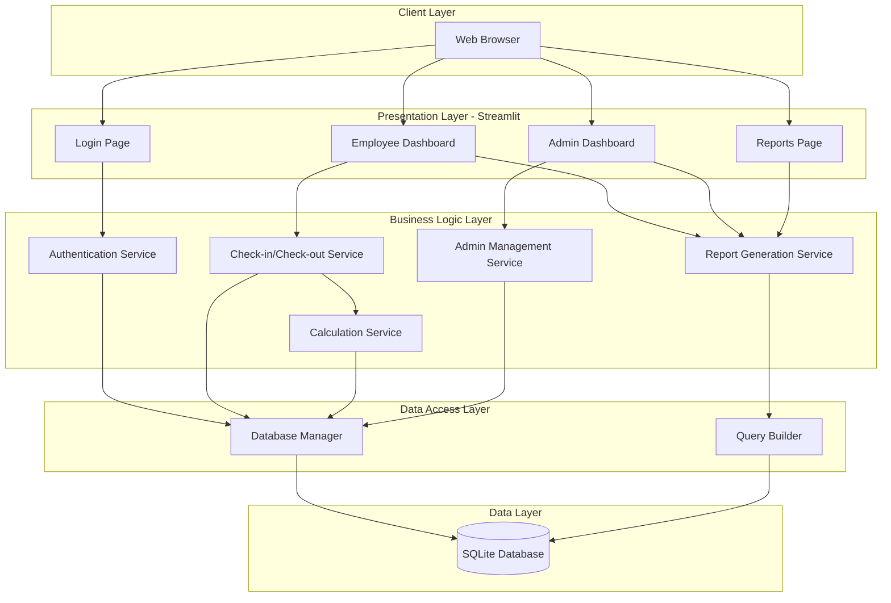
```mermaid
graph TB
    subgraph "Client Layer"
        A[Web Browser]
    end
    
    subgraph "Presentation Layer - Streamlit"
        B[Login Page]
        C[Employee Dashboard]
        D[Admin Dashboard]
        E[Reports Page]
    end
    
    subgraph "Business Logic Layer"
        F[Authentication Service]
        G[Check-in/Check-out Service]
        H[Calculation Service]
        I[Report Generation Service]
        J[Admin Management Service]
    end
    
    subgraph "Data Access Layer"
        K[Database Manager]
        L[Query Builder]
    end
    
    subgraph "Data Layer"
        M[(SQLite Database)]
    end
    
    A --> B
    A --> C
    A --> D
    A --> E
    
    B --> F
    C --> G
    C --> I
    D --> J
    D --> I
    E --> I
    
    F --> K
    G --> H
    G --> K
    H --> K
    I --> L
    J --> K
    
    K --> M
    L --> M
```
Application Structure


``` mermaid
graph LR
    subgraph "Project Structure"
        A[app.py] --> B[Main Entry Point]
        
        C[config/] --> C1[config.py]
        C --> C2[.env]
        
        D[database/] --> D1[models.py]
        D --> D2[db_manager.py]
        D --> D3[init_db.py]
        
        E[services/] --> E1[auth_service.py]
        E --> E2[checkin_service.py]
        E --> E3[calculation_service.py]
        E --> E4[report_service.py]
        E --> E5[admin_service.py]
        
        F[pages/] --> F1[employee_dashboard.py]
        F --> F2[admin_dashboard.py]
        F --> F3[reports.py]
        
        G[utils/] --> G1[validators.py]
        G --> G2[helpers.py]
        G --> G3[constants.py]
        G --> G4[logger.py]
        
        H[data/] --> H1[attendance.db]
    end
```

## 4. Database Schema

### Entity Relationship Diagram

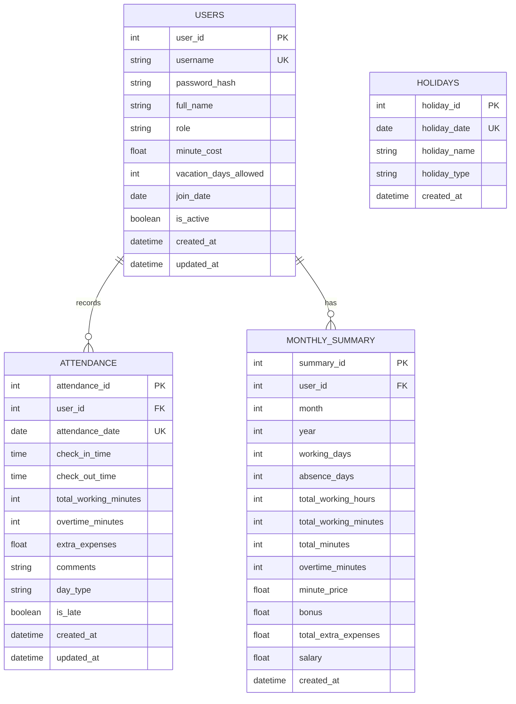
``` mermaid
erDiagram
    USERS ||--o{ ATTENDANCE : records
    USERS ||--o{ MONTHLY_SUMMARY : has
    USERS {
        int user_id PK
        string username UK
        string password_hash
        string full_name
        string role
        float minute_cost
        int vacation_days_allowed
        date join_date
        boolean is_active
        datetime created_at
        datetime updated_at
    }
    
    ATTENDANCE {
        int attendance_id PK
        int user_id FK
        date attendance_date UK
        time check_in_time
        time check_out_time
        int total_working_minutes
        int overtime_minutes
        float extra_expenses
        string comments
        string day_type
        boolean is_late
        datetime created_at
        datetime updated_at
    }
    
    MONTHLY_SUMMARY {
        int summary_id PK
        int user_id FK
        int month
        int year
        int working_days
        int absence_days
        int total_working_hours
        int total_working_minutes
        int total_minutes
        int overtime_minutes
        float minute_price
        float bonus
        float total_extra_expenses
        float salary
        datetime created_at
    }
    
    HOLIDAYS {
        int holiday_id PK
        date holiday_date UK
        string holiday_name
        string holiday_type
        datetime created_at
    }
```

### Table Definitions

#### 1. USERS Table

``` database
CREATE TABLE users (
    user_id INTEGER PRIMARY KEY AUTOINCREMENT,
    username TEXT UNIQUE NOT NULL,
    password_hash TEXT NOT NULL,
    full_name TEXT NOT NULL,
    role TEXT NOT NULL CHECK(role IN ('employee', 'admin')),
    minute_cost REAL DEFAULT 0.0,
    vacation_days_allowed INTEGER DEFAULT 21,
    join_date DATE NOT NULL,
    is_active BOOLEAN DEFAULT 1,
    created_at TIMESTAMP DEFAULT CURRENT_TIMESTAMP,
    updated_at TIMESTAMP DEFAULT CURRENT_TIMESTAMP
);

CREATE INDEX idx_users_username ON users(username);
CREATE INDEX idx_users_role ON users(role);
```

#### 2. ATTENDANCE Table

```
CREATE TABLE attendance (
    attendance_id INTEGER PRIMARY KEY AUTOINCREMENT,
    user_id INTEGER NOT NULL,
    attendance_date DATE NOT NULL,
    check_in_time TIME,
    check_out_time TIME,
    total_working_minutes INTEGER DEFAULT 0,
    overtime_minutes INTEGER DEFAULT 0,
    extra_expenses REAL DEFAULT 0.0,
    comments TEXT,
    day_type TEXT DEFAULT 'working_day' 
        CHECK(day_type IN ('working_day', 'holiday', 'normal_vacation', 'sick_leave', 'absence')),
    is_late BOOLEAN DEFAULT 0,
    created_at TIMESTAMP DEFAULT CURRENT_TIMESTAMP,
    updated_at TIMESTAMP DEFAULT CURRENT_TIMESTAMP,
    FOREIGN KEY (user_id) REFERENCES users(user_id),
    UNIQUE(user_id, attendance_date)
);

CREATE INDEX idx_attendance_user_date ON attendance(user_id, attendance_date);
CREATE INDEX idx_attendance_date ON attendance(attendance_date);
CREATE INDEX idx_attendance_day_type ON attendance(day_type);
```

#### 3. MONTHLY_SUMMARY Table

```
CREATE TABLE monthly_summary (
    summary_id INTEGER PRIMARY KEY AUTOINCREMENT,
    user_id INTEGER NOT NULL,
    month INTEGER NOT NULL,
    year INTEGER NOT NULL,
    working_days INTEGER DEFAULT 0,
    absence_days INTEGER DEFAULT 0,
    total_working_hours INTEGER DEFAULT 0,
    total_working_minutes INTEGER DEFAULT 0,
    total_minutes INTEGER DEFAULT 0,
    overtime_minutes INTEGER DEFAULT 0,
    minute_price REAL DEFAULT 0.0,
    bonus REAL DEFAULT 0.0,
    total_extra_expenses REAL DEFAULT 0.0,
    salary REAL DEFAULT 0.0,
    created_at TIMESTAMP DEFAULT CURRENT_TIMESTAMP,
    FOREIGN KEY (user_id) REFERENCES users(user_id),
    UNIQUE(user_id, month, year)
);

CREATE INDEX idx_monthly_summary_user ON monthly_summary(user_id, year, month);
```

#### 4. HOLIDAYS Table

```
CREATE TABLE holidays (
    holiday_id INTEGER PRIMARY KEY AUTOINCREMENT,
    holiday_date DATE UNIQUE NOT NULL,
    holiday_name TEXT NOT NULL,
    holiday_type TEXT DEFAULT 'public_holiday',
    created_at TIMESTAMP DEFAULT CURRENT_TIMESTAMP
);

CREATE INDEX idx_holidays_date ON holidays(holiday_date);
```

## 5. Data Flow

### 5.1 Authentication Flow

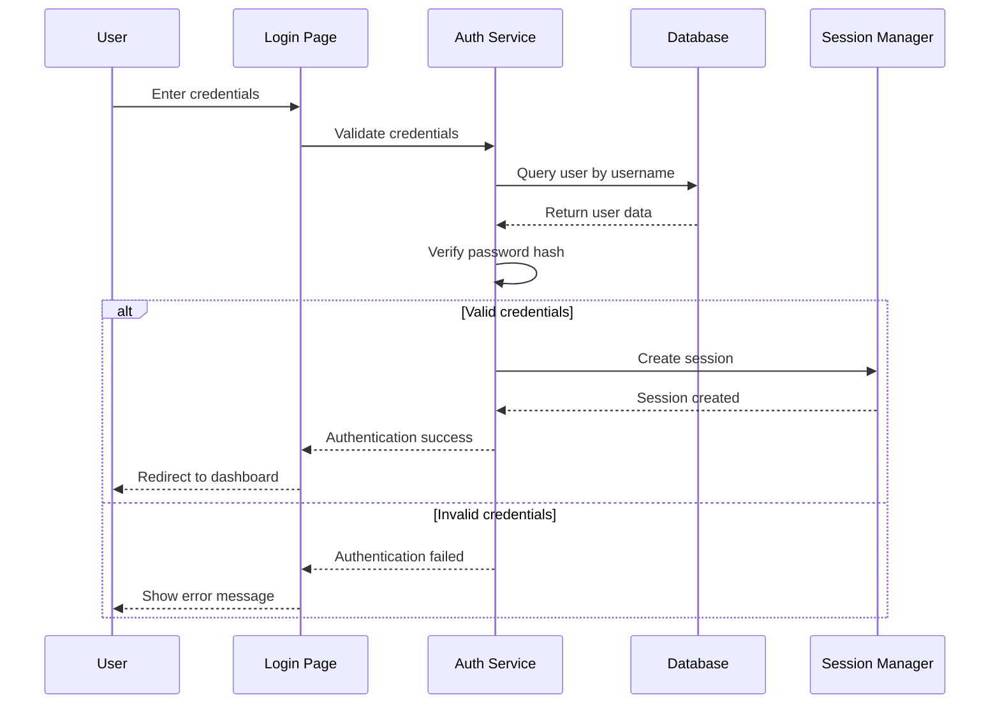
```mermaid
sequenceDiagram
    participant U as User
    participant L as Login Page
    participant A as Auth Service
    participant D as Database
    participant S as Session Manager
    
    U->>L: Enter credentials
    L->>A: Validate credentials
    A->>D: Query user by username
    D-->>A: Return user data
    A->>A: Verify password hash
    alt Valid credentials
        A->>S: Create session
        S-->>A: Session created
        A-->>L: Authentication success
        L-->>U: Redirect to dashboard
    else Invalid credentials
        A-->>L: Authentication failed
        L-->>U: Show error message
    end
```

### 5.2 Check-in Flow 

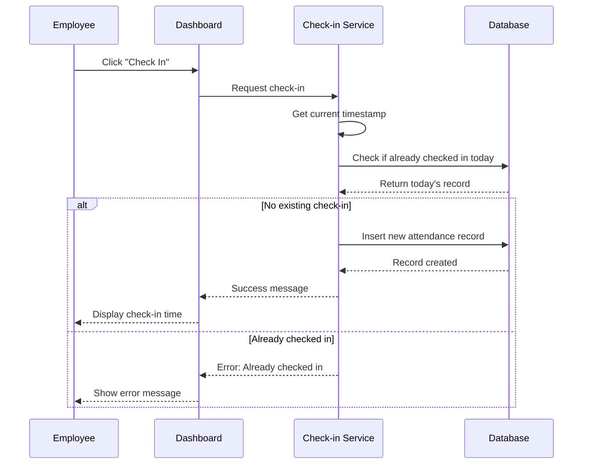
```mermaid
sequenceDiagram
    participant E as Employee
    participant D as Dashboard
    participant C as Check-in Service
    participant DB as Database
    
    E->>D: Click "Check In"
    D->>C: Request check-in
    C->>C: Get current timestamp
    C->>DB: Check if already checked in today
    DB-->>C: Return today's record
    
    alt No existing check-in
        C->>DB: Insert new attendance record
        DB-->>C: Record created
        C-->>D: Success message
        D-->>E: Display check-in time
    else Already checked in
        C-->>D: Error: Already checked in
        D-->>E: Show error message
    end
```

### 5.3 Check-out Flow

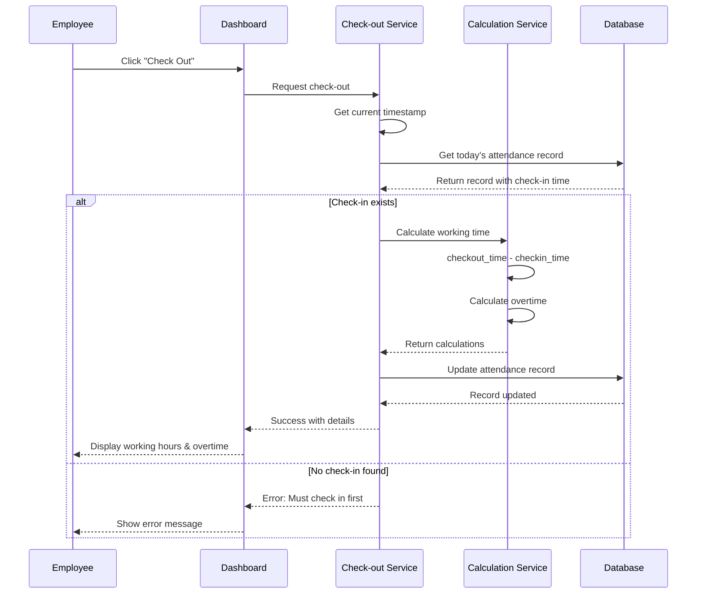
```mermaid
sequenceDiagram
    participant E as Employee
    participant D as Dashboard
    participant C as Check-out Service
    participant T as Calculation Service
    participant DB as Database
    
    E->>D: Click "Check Out"
    D->>C: Request check-out
    C->>C: Get current timestamp
    C->>DB: Get today's attendance record
    DB-->>C: Return record with check-in time
    
    alt Check-in exists
        C->>T: Calculate working time
        T->>T: checkout_time - checkin_time
        T->>T: Calculate overtime
        T-->>C: Return calculations
        C->>DB: Update attendance record
        DB-->>C: Record updated
        C-->>D: Success with details
        D-->>E: Display working hours & overtime
    else No check-in found
        C-->>D: Error: Must check in first
        D-->>E: Show error message
    end
```

### 5.4 Monthly Report Generation Flow

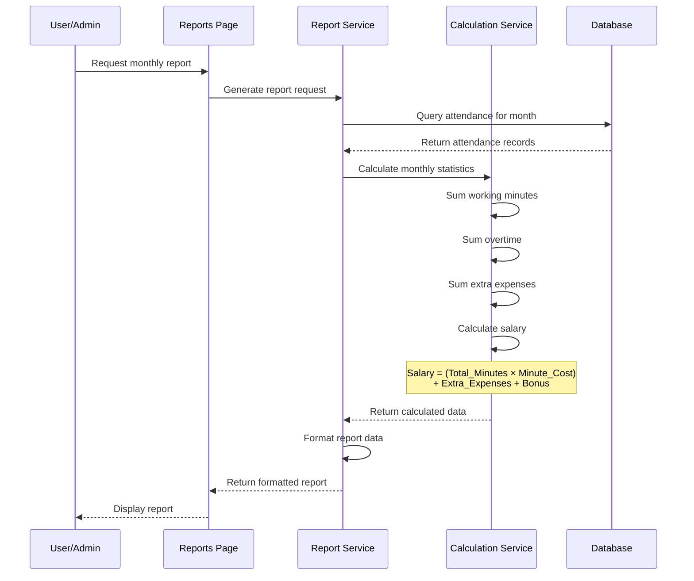
```mermaid
sequenceDiagram
    participant U as User/Admin
    participant R as Reports Page
    participant RS as Report Service
    participant CS as Calculation Service
    participant DB as Database
    
    U->>R: Request monthly report
    R->>RS: Generate report request
    
    RS->>DB: Query attendance for month
    DB-->>RS: Return attendance records
    
    RS->>CS: Calculate monthly statistics
    CS->>CS: Sum working minutes
    CS->>CS: Sum overtime
    CS->>CS: Sum extra expenses
    CS->>CS: Calculate salary
    Note over CS: Salary = (Total_Minutes × Minute_Cost)<br/>+ Extra_Expenses + Bonus
    CS-->>RS: Return calculated data
    
    RS->>RS: Format report data
    RS-->>R: Return formatted report
    R-->>U: Display report
```

### 5.5 Admin Management Flow

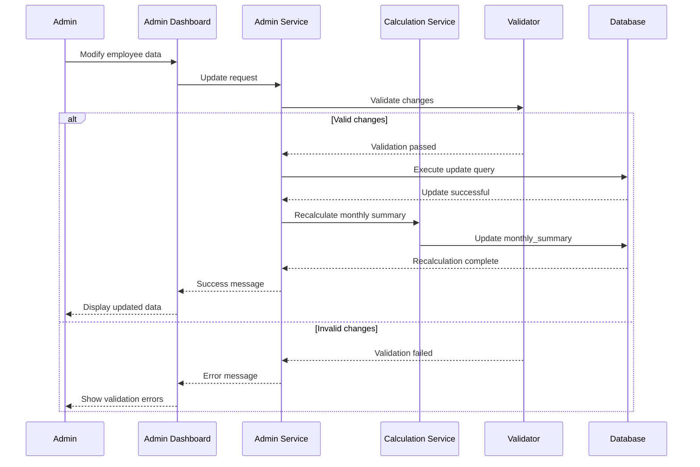
```mermaid
sequenceDiagram
    participant A as Admin
    participant AD as Admin Dashboard
    participant AS as Admin Service
    participant CS as Calculation Service
    participant V as Validator
    participant DB as Database
    
    A->>AD: Modify employee data
    AD->>AS: Update request
    AS->>V: Validate changes
    
    alt Valid changes
        V-->>AS: Validation passed
        AS->>DB: Execute update query
        DB-->>AS: Update successful
        AS->>CS: Recalculate monthly summary
        CS->>DB: Update monthly_summary
        DB-->>AS: Recalculation complete
        AS-->>AD: Success message
        AD-->>A: Display updated data
    else Invalid changes
        V-->>AS: Validation failed
        AS-->>AD: Error message
        AD-->>A: Show validation errors
    end
```

## 6. Module Design

### 6.1 Authentication Service

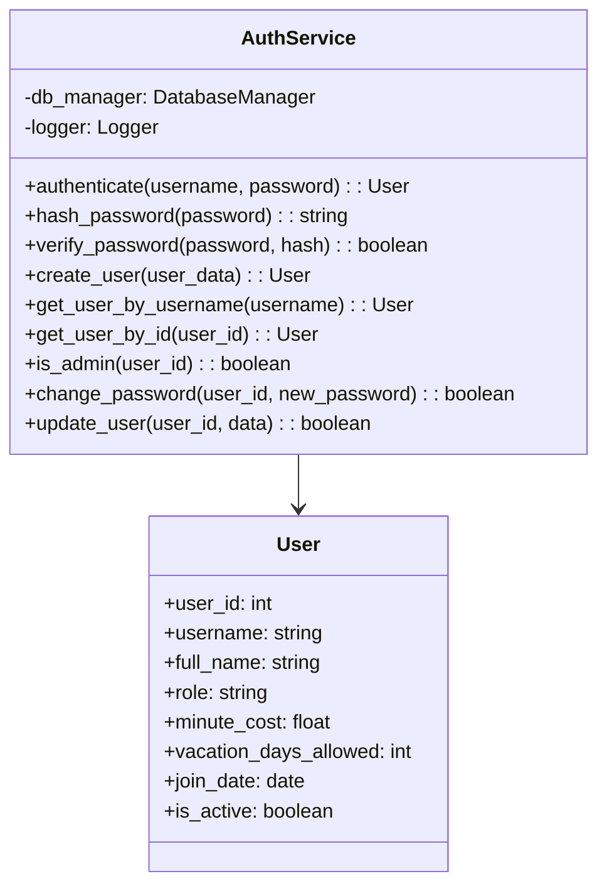
```mermaid
classDiagram
    class AuthService {
        -db_manager: DatabaseManager
        -logger: Logger
        +authenticate(username, password): User
        +hash_password(password): string
        +verify_password(password, hash): boolean
        +create_user(user_data): User
        +get_user_by_username(username): User
        +get_user_by_id(user_id): User
        +is_admin(user_id): boolean
        +change_password(user_id, new_password): boolean
        +update_user(user_id, data): boolean
    }
    
    class User {
        +user_id: int
        +username: string
        +full_name: string
        +role: string
        +minute_cost: float
        +vacation_days_allowed: int
        +join_date: date
        +is_active: boolean
    }
    
    AuthService --> User
```

#### Responsibilities:

* User authentication and authorization
* Password hashing and verification using bcrypt
* Session management
* Role-based access control
* User CRUD operations

### 6.2 Check-in/Check-out Service

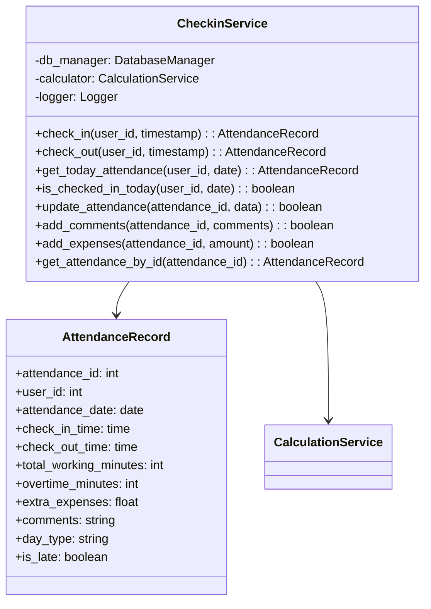
```mermaid
classDiagram
    class CheckinService {
        -db_manager: DatabaseManager
        -calculator: CalculationService
        -logger: Logger
        +check_in(user_id, timestamp): AttendanceRecord
        +check_out(user_id, timestamp): AttendanceRecord
        +get_today_attendance(user_id, date): AttendanceRecord
        +is_checked_in_today(user_id, date): boolean
        +update_attendance(attendance_id, data): boolean
        +add_comments(attendance_id, comments): boolean
        +add_expenses(attendance_id, amount): boolean
        +get_attendance_by_id(attendance_id): AttendanceRecord
    }
    
    class AttendanceRecord {
        +attendance_id: int
        +user_id: int
        +attendance_date: date
        +check_in_time: time
        +check_out_time: time
        +total_working_minutes: int
        +overtime_minutes: int
        +extra_expenses: float
        +comments: string
        +day_type: string
        +is_late: boolean
    }
    
    CheckinService --> AttendanceRecord
    CheckinService --> CalculationService
```

#### Responsibilities:

* Handle check-in operations
* Handle check-out operations
* Validate check-in/out constraints
* Update attendance records
* Track extra expenses and comments
* Delegate time calculations to CalculationService

### 6.3 Calculation Service

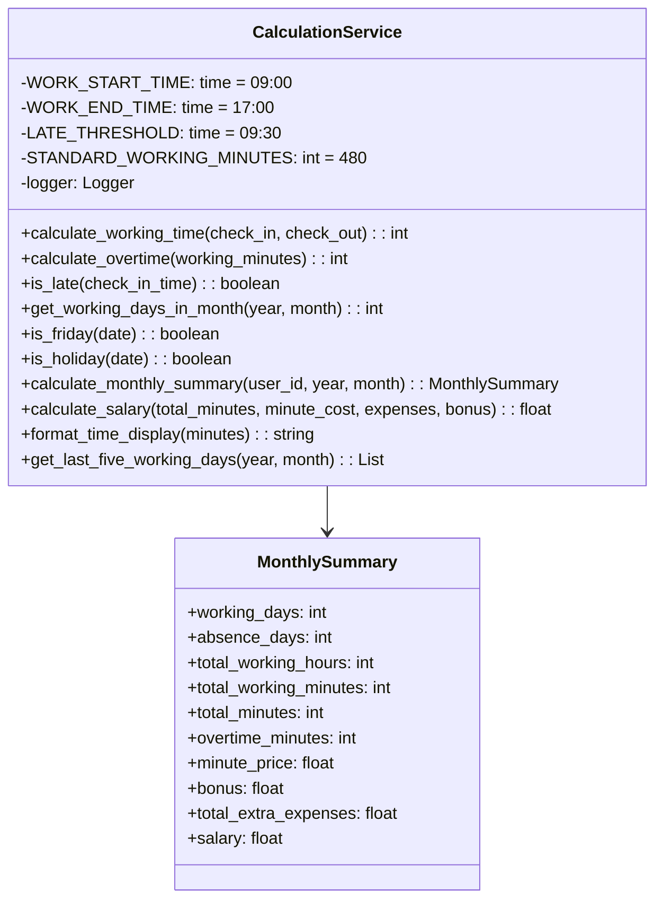
```mermaid
classDiagram
    class CalculationService {
        -WORK_START_TIME: time = 09:00
        -WORK_END_TIME: time = 17:00
        -LATE_THRESHOLD: time = 09:30
        -STANDARD_WORKING_MINUTES: int = 480
        -logger: Logger
        +calculate_working_time(check_in, check_out): int
        +calculate_overtime(working_minutes): int
        +is_late(check_in_time): boolean
        +get_working_days_in_month(year, month): int
        +is_friday(date): boolean
        +is_holiday(date): boolean
        +calculate_monthly_summary(user_id, year, month): MonthlySummary
        +calculate_salary(total_minutes, minute_cost, expenses, bonus): float
        +format_time_display(minutes): string
        +get_last_five_working_days(year, month): List
    }
    
    class MonthlySummary {
        +working_days: int
        +absence_days: int
        +total_working_hours: int
        +total_working_minutes: int
        +total_minutes: int
        +overtime_minutes: int
        +minute_price: float
        +bonus: float
        +total_extra_expenses: float
        +salary: float
    }
    
    CalculationService --> MonthlySummary
```

#### Responsibilities:

* Calculate total working time from check-in/out
* Calculate overtime (positive/negative)
* Determine if employee is late (>9:30)
* Calculate working days in month (exclude Fridays)
* Handle holiday checking
* **Calculate salary: (Total_Minutes × Minute_Cost) + Extra_Expenses + Bonus**
* Format time displays

### 6.4 Report Service

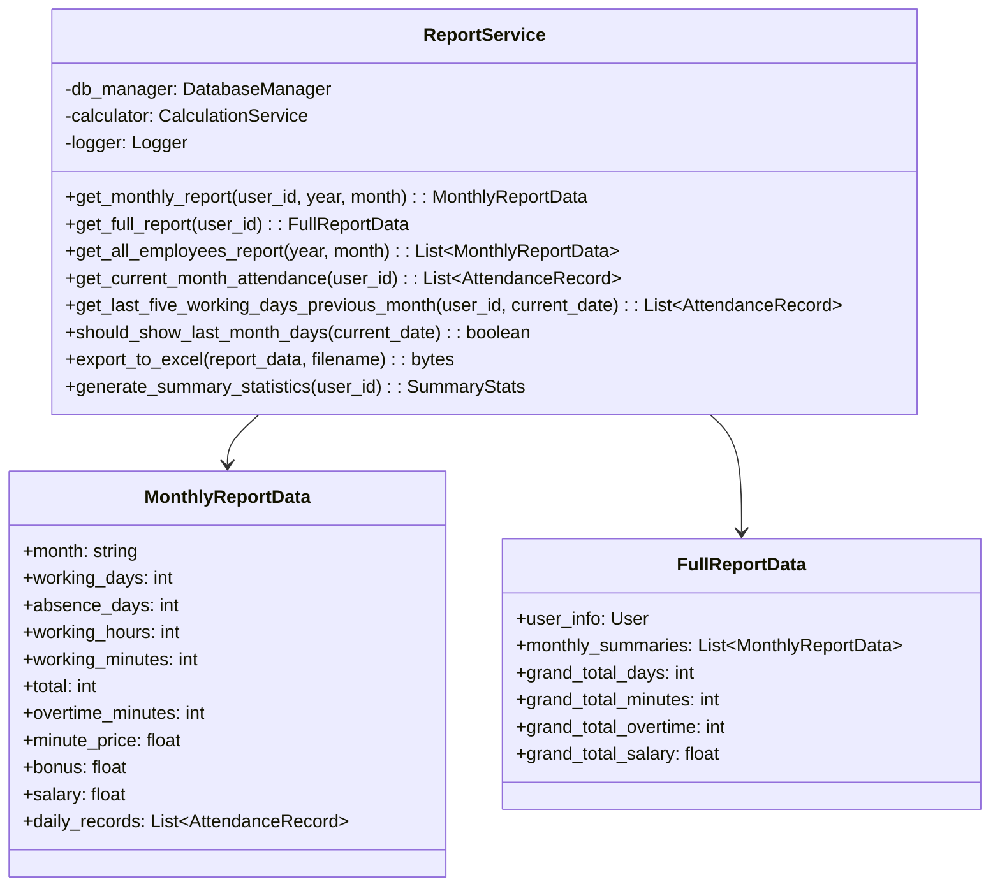
```mermaid
classDiagram
    class ReportService {
        -db_manager: DatabaseManager
        -calculator: CalculationService
        -logger: Logger
        +get_monthly_report(user_id, year, month): MonthlyReportData
        +get_full_report(user_id): FullReportData
        +get_all_employees_report(year, month): List~MonthlyReportData~
        +get_current_month_attendance(user_id): List~AttendanceRecord~
        +get_last_five_working_days_previous_month(user_id, current_date): List~AttendanceRecord~
        +should_show_last_month_days(current_date): boolean
        +export_to_excel(report_data, filename): bytes
        +generate_summary_statistics(user_id): SummaryStats
    }
    
    class MonthlyReportData {
        +month: string
        +working_days: int
        +absence_days: int
        +working_hours: int
        +working_minutes: int
        +total: int
        +overtime_minutes: int
        +minute_price: float
        +bonus: float
        +salary: float
        +daily_records: List~AttendanceRecord~
    }
    
    class FullReportData {
        +user_info: User
        +monthly_summaries: List~MonthlyReportData~
        +grand_total_days: int
        +grand_total_minutes: int
        +grand_total_overtime: int
        +grand_total_salary: float
    }
    
    ReportService --> MonthlyReportData
    ReportService --> FullReportData
```

#### Responsibilities:

* Generate monthly reports with accurate columns
* Generate full historical reports
* Calculate monthly statistics
* Filter and display last 5 working days from previous month (only until 8th)
* Export reports to Excel
* Aggregate data for all employees

### 6.5 Admin Service

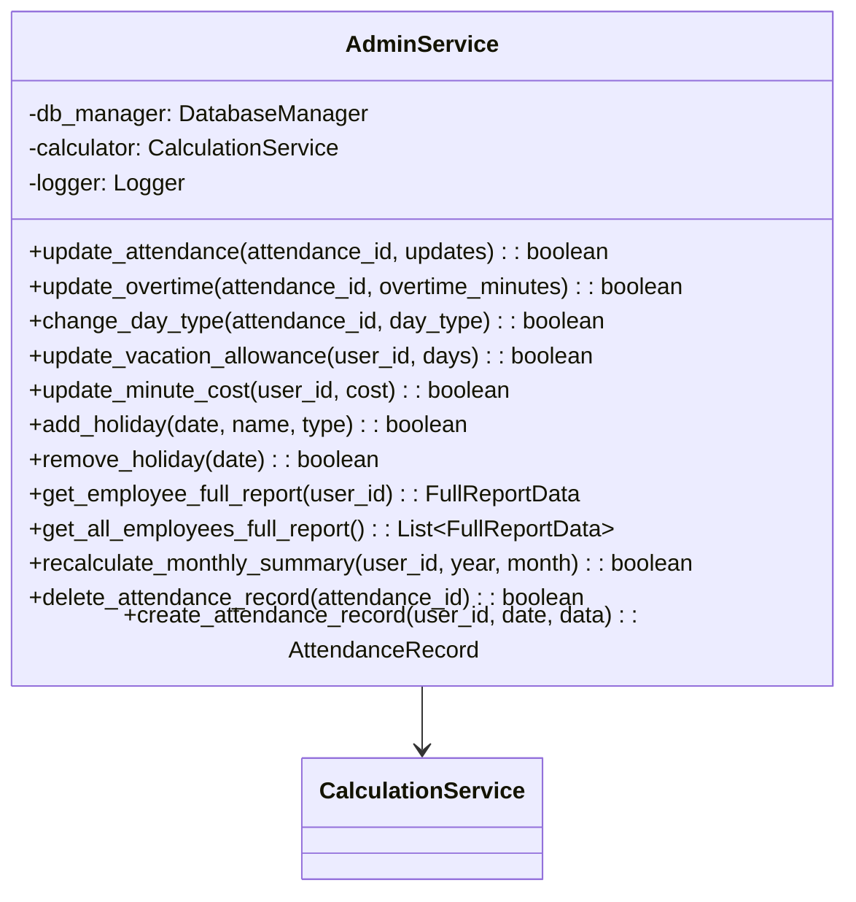
```mermaid
classDiagram
    class AdminService {
        -db_manager: DatabaseManager
        -calculator: CalculationService
        -logger: Logger
        +update_attendance(attendance_id, updates): boolean
        +update_overtime(attendance_id, overtime_minutes): boolean
        +change_day_type(attendance_id, day_type): boolean
        +update_vacation_allowance(user_id, days): boolean
        +update_minute_cost(user_id, cost): boolean
        +add_holiday(date, name, type): boolean
        +remove_holiday(date): boolean
        +get_employee_full_report(user_id): FullReportData
        +get_all_employees_full_report(): List~FullReportData~
        +recalculate_monthly_summary(user_id, year, month): boolean
        +delete_attendance_record(attendance_id): boolean
        +create_attendance_record(user_id, date, data): AttendanceRecord
    }
    
    AdminService --> CalculationService
```

#### Responsibilities:

* Modify any attendance record
* Update overtime values (admin-only)
* Change day types (holiday, vacation, sick leave)
* Manage vacation allowances
* Set employee minute costs
* Manage public holidays
* Trigger recalculations after changes
* Full CRUD access to all employee data

## 7. Authentication & Authorization

### Authentication Mechanism

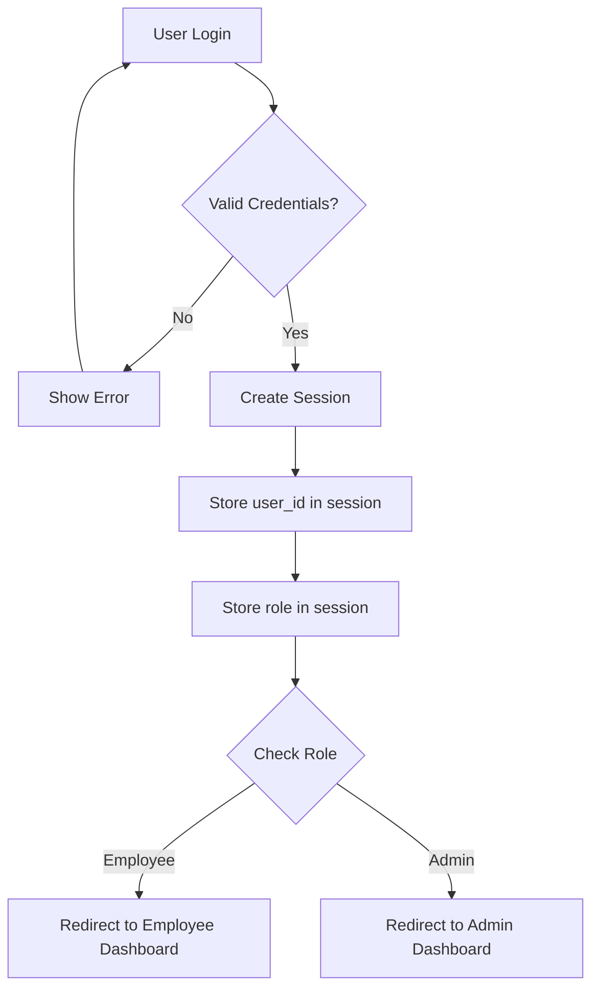
```mermaid
flowchart TD
    A[User Login] --> B{Valid Credentials?}
    B -->|No| C[Show Error]
    B -->|Yes| D[Create Session]
    D --> E[Store user_id in session]
    E --> F[Store role in session]
    F --> G{Check Role}
    G -->|Employee| H[Redirect to Employee Dashboard]
    G -->|Admin| I[Redirect to Admin Dashboard]
    
    C --> A
```

### Authorization Matrix

| Feature | Employee | Admin |
|---------|----------|-------|
| Check-in/Check-out | ✓ | ✓ |
| View own attendance | ✓ | ✓ |
| View monthly report (own) | ✓ | ✓ |
| View overtime (own) | ✓ | ✓ |
| Edit overtime | ✗ | ✓ |
| Add comments/expenses | ✓ | ✓ |
| View other employees' data | ✗ | ✓ |
| Edit any attendance record | ✗ | ✓ |
| Change day types | ✗ | ✓ |


## 8. Business Logic

### 8.1 Working Hours Rules

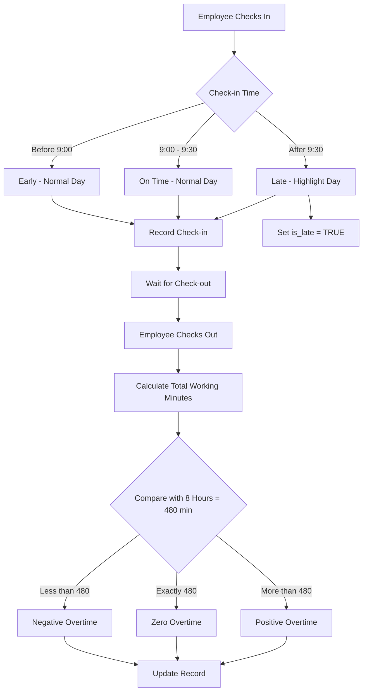
```mermaid
flowchart TD
    A[Employee Checks In] --> B{Check-in Time}
    B -->|Before 9:00| C[Early - Normal Day]
    B -->|9:00 - 9:30| D[On Time - Normal Day]
    B -->|After 9:30| E[Late - Highlight Day]
    
    C --> F[Record Check-in]
    D --> F
    E --> F
    E --> G[Set is_late = TRUE]
    
    F --> H[Wait for Check-out]
    
    H --> I[Employee Checks Out]
    I --> J[Calculate Total Working Minutes]
    J --> K{Compare with 8 Hours = 480 min}
    K -->|Less than 480| L[Negative Overtime]
    K -->|Exactly 480| M[Zero Overtime]
    K -->|More than 480| N[Positive Overtime]
    
    L --> O[Update Record]
    M --> O
    N --> O
```

### 8.2 Overtime Calculation Logic
> **Standard Working Hours:** 9:00 AM - 5:00 PM (8 hours = 480 minutes)

#### Calculation Formula:

```
Working_Minutes = (Check-out Time - Check-in Time) in minutes
Overtime_Minutes = Working_Minutes - 480

If Overtime_Minutes > 0: Positive overtime (extra work)
If Overtime_Minutes < 0: Negative overtime (less work)
If Overtime_Minutes = 0: Exactly 8 hours worked
```

#### Example Scenarios:

| Check-in | Check-out | Working Time | Working Minutes | Overtime | Status |
|----------|-----------|--------------|-----------------|----------|--------|
| 09:00 | 17:00 | 8h 0m | 480 | 0 | Normal |
| 09:00 | 18:30 | 9h 30m | 570 | +90 | Positive |
| 09:30 | 17:00 | 7h 30m | 450 | -30 | Negative (Late) |
| 08:30 | 17:30 | 9h 0m | 540 | +60 | Positive |
| 10:00 | 17:00 | 7h 0m | 420 | -60 | Negative (Late) |

### 8.3 Day Type Management

```mermad
stateDiagram-v2
    [*] --> WorkingDay: Default
    
    WorkingDay --> Holiday: Admin changes
    WorkingDay --> NormalVacation: Admin changes
    WorkingDay --> SickLeave: Admin changes
    WorkingDay --> Absence: No check-in
    
    Holiday --> WorkingDay: Admin changes
    NormalVacation --> WorkingDay: Admin changes
    SickLeave --> WorkingDay: Admin changes
    Absence --> WorkingDay: Admin changes
    
    Holiday --> [*]: No attendance calculation
    NormalVacation --> [*]: Counts as working day
    SickLeave --> [*]: Counts as working day
    Absence --> [*]: Counts as absence
    WorkingDay --> [*]: Normal calculation
```

#### Day Type Rules:

* working_day: Normal attendance with time tracking
* holiday: No work expected, no calculation
* normal_vacation: Counts as present, uses vacation allowance
* sick_leave: Counts as present, no vacation deduction
* absence: Counts as absence, may affect salary

### 8.4 Monthly Working Days Calculation

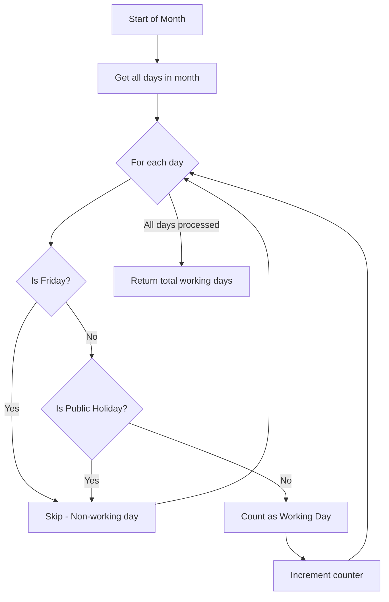
``` mermaid
flowchart TD
    A[Start of Month] --> B[Get all days in month]
    B --> C{For each day}
    C --> D{Is Friday?}
    D -->|Yes| E[Skip - Non-working day]
    D -->|No| F{Is Public Holiday?}
    F -->|Yes| E
    F -->|No| G[Count as Working Day]
    
    E --> C
    G --> H[Increment counter]
    H --> C
    
    C -->|All days processed| I[Return total working days]
```

#### Egyptian Work Week:

* Working Days: Saturday - Thursday (6 days per week)
* Weekend: Friday only
* Working hours per day: 8 hours (480 minutes)

### 8.5 Last 5 Working Days Display Logic

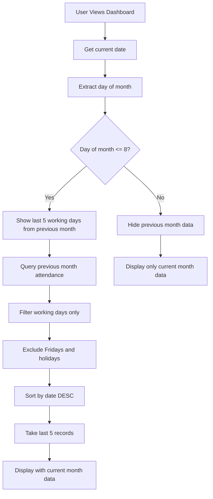
```mermaid
flowchart TD
    A[User Views Dashboard] --> B[Get current date]
    B --> C[Extract day of month]
    C --> D{Day of month <= 8?}
    D -->|Yes| E[Show last 5 working days from previous month]
    D -->|No| F[Hide previous month data]
    
    E --> G[Query previous month attendance]
    G --> H[Filter working days only]
    H --> I[Exclude Fridays and holidays]
    I --> J[Sort by date DESC]
    J --> K[Take last 5 records]
    K --> L[Display with current month data]
    
    F --> M[Display only current month data]
```

#### Logic:

* If current date is between 1st and 8th: Show last 5 working days from previous month
* If current date is 9th or later: Hide previous month data
* Working days exclude Fridays and public holidays

## 9. Calculation Engine

### 9.1 Salary Calculation Flow

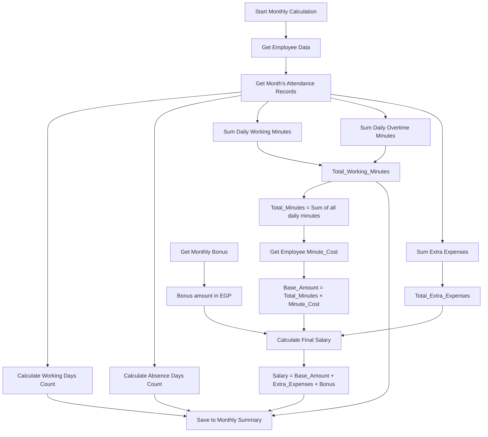
```mermaid
flowchart TD
    A[Start Monthly Calculation] --> B[Get Employee Data]
    B --> C[Get Month's Attendance Records]
    
    C --> D[Calculate Working Days Count]
    C --> E[Calculate Absence Days Count]
    C --> F[Sum Daily Working Minutes]
    C --> G[Sum Daily Overtime Minutes]
    C --> H[Sum Extra Expenses]
    
    F --> I[Total_Working_Minutes]
    G --> I
    
    I --> J[Total_Minutes = Sum of all daily minutes]
    
    J --> K[Get Employee Minute_Cost]
    H --> L[Total_Extra_Expenses]
    
    K --> M[Base_Amount = Total_Minutes × Minute_Cost]
    
    N[Get Monthly Bonus] --> O[Bonus amount in EGP]
    
    M --> P[Calculate Final Salary]
    L --> P
    O --> P
    
    P --> Q[Salary = Base_Amount + Extra_Expenses + Bonus]
    
    Q --> R[Save to Monthly Summary]
    
    D --> R
    E --> R
    I --> R
```

### 9.2 Salary Calculation Formula (CORRECTED)

#### Correct Formula per Requirements:

```
Total_Working_Minutes = Sum of (daily_working_minutes + daily_overtime_minutes) for all days in month

Salary (EGP) = (Total_Working_Minutes × Minute_Cost) + Total_Extra_Expenses + Bonus
```

#### Considering:

* Total_Working_Minutes: Sum of actual working minutes including overtime adjustments for each day
* Minute_Cost: Employee's cost per minute (set by admin, in EGP)
* Total_Extra_Expenses: Sum of all extra_expenses entries for the month (in EGP)
* Bonus: Monthly bonus set by admin (in EGP, can be positive or negative)

#### Example

**Employee: Mohamed**

* Minute Cost: 5 EGP/minute
* Month: March 2025
* Working Days: 25 days

**Daily Attendance:**

| Day | Working Minutes | Overtime | Total Daily Minutes |
|-----|-----------------|----------|---------------------|
| Day 1 | 480 | 0 | 480 |
| Day 2 | 490 | +10 | 490 |
| Day 3 | 450 | -30 | 450 |
| ... | ... | ... | ... |
| Day 25 | 500 | +20 | 500 |

***Total_Working_Minutes = 480 + 490 + 450 + ... + 500 = 12,100 minutes***

**Extra Expenses:**

* Transportation: 500 EGP
* Meals: 300 EGP
* Total: 800 EGP

**Bonus:** 1,000 EGP (set by admin)

**Salary Calculation:**

```
Base Amount = 12,100 minutes × 5 EGP/minute = 60,500 EGP
Extra Expenses = 800 EGP
Bonus = 1,000 EGP

Final Salary = 60,500 + 800 + 1,000 = 62,300 EGP
```

### 9.3 Monthly Summary Calculation Process

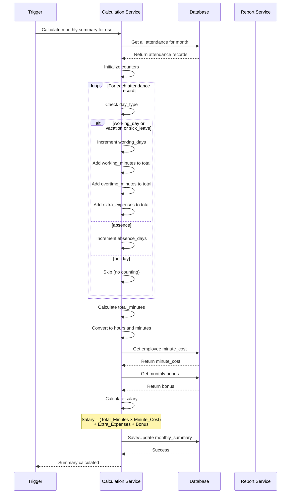
```mermaid
sequenceDiagram
    participant T as Trigger
    participant CS as Calculation Service
    participant DB as Database
    participant RS as Report Service
    
    T->>CS: Calculate monthly summary for user
    CS->>DB: Get all attendance for month
    DB-->>CS: Return attendance records
    
    CS->>CS: Initialize counters
    
    loop For each attendance record
        CS->>CS: Check day_type
        alt working_day or vacation or sick_leave
            CS->>CS: Increment working_days
            CS->>CS: Add working_minutes to total
            CS->>CS: Add overtime_minutes to total
            CS->>CS: Add extra_expenses to total
        else absence
            CS->>CS: Increment absence_days
        else holiday
            CS->>CS: Skip (no counting)
        end
    end
    
    CS->>CS: Calculate total_minutes
    CS->>CS: Convert to hours and minutes
    CS->>DB: Get employee minute_cost
    DB-->>CS: Return minute_cost
    CS->>DB: Get monthly bonus
    DB-->>CS: Return bonus
    
    CS->>CS: Calculate salary
    Note over CS: Salary = (Total_Minutes × Minute_Cost)<br/>+ Extra_Expenses + Bonus
    
    CS->>DB: Save/Update monthly_summary
    DB-->>CS: Success
    CS-->>T: Summary calculated
```

## 10. Reporting System

### 10.1 Report Types

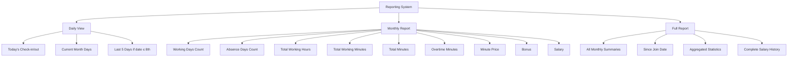
```mermaid
graph TD
    A[Reporting System] --> B[Daily View]
    A --> C[Monthly Report]
    A --> D[Full Report]
    
    B --> B1[Today's Check-in/out]
    B --> B2[Current Month Days]
    B --> B3[Last 5 Days if date ≤ 8th]
    
    C --> C1[Working Days Count]
    C --> C2[Absence Days Count]
    C --> C3[Total Working Hours]
    C --> C4[Total Working Minutes]
    C --> C5[Total Minutes]
    C --> C6[Overtime Minutes]
    C --> C7[Minute Price]
    C --> C8[Bonus]
    C --> C9[Salary]
    
    D --> D1[All Monthly Summaries]
    D --> D2[Since Join Date]
    D --> D3[Aggregated Statistics]
    D --> D4[Complete Salary History]
```

### 10.2 Full Report Table Structure

**Full Report Columns (as specified):**

| Column | Description | Type |
|--------|-------------|------|
| Month | Month name and year (e.g., "January 2025") | String |
| Working Days | Number of days worked in month | Integer |
| Absence Days | Number of absent days | Integer |
| Working Time (Hrs) | Total hours component | Integer |
| Working Time (Min) | Remaining minutes component | Integer |
| Total | Total working minutes | Integer |
| Overtime (Min) | Total overtime in minutes | Integer |
| Minute price (EGP) | Cost per minute | Float |
| Bonus (EGP) | Monthly bonus amount | Float |
| Salary (EGP) | Total monthly salary | Float |

### 10.3 Report Generation Flow

```mermaid
flowchart TD
    A[Report Request] --> B{Report Type?}
    
    B -->|Daily View| C[Get today's attendance]
    B -->|Monthly Report| D[Get month's summary]
    B -->|Full Report| E[Get all summaries]
    
    C --> F[Get current month attendance]
    F --> G{Current date ≤ 8?}
    G -->|Yes| H[Query last 5 working days from prev month]
    G -->|No| I[Current month only]
    H --> J[Combine prev + current]
    I --> J
    J --> K[Format and display]
    
    D --> L[Get/Calculate monthly summary]
    L --> M[Format table with all columns]
    M --> N[Display monthly report]
    
    E --> O[Query all monthly_summary records]
    O --> P[Sort by year, month]
    P --> Q[Format full report table]
    Q --> R[Calculate grand totals]
    R --> S[Display full report]
    
    K --> T{Export requested?}
    N --> T
    S --> T
    T -->|Yes| U[Generate Excel file]
    T -->|No| V[End]
    U --> V
```

### 10.4 Employee Report vs Admin Report

```mermaid
graph LR
    subgraph "Employee View"
        A1[Own Daily Attendance]
        A2[Own Monthly Report]
        A3[View Overtime - Read Only]
        A4[Add Comments/Expenses]
    end
    
    subgraph "Admin View"
        B1[All Employees Daily]
        B2[All Employees Monthly]
        B3[Edit Overtime]
        B4[Edit All Fields]
        B5[Change Day Types]
        B6[Full Historical Reports]
        B7[Export to Excel]
    end
```

## 11. Deployment Architecture

### 11.1 Local Deployment

```mermaid
graph TB
    subgraph "Local Machine"
        A[Streamlit App :8501] --> B[(SQLite DB)]
        A --> C[Config Files]
        A --> D[Log Files]
        
        E[Browser] --> F[localhost:8501]
        F --> A
    end
```

**Setup Steps:**

1. Install Python 3.9+
2. Install dependencies: pip install -r requirements.txt
3. Configure .env file
4. Initialize database: python database/init_db.py
5. Run app: streamlit run app.py
6. Access at: http://localhost:8501

### 11.2 Network Deployment (Small Office)

```mermaid
graph TB
    subgraph "Office Network 192.168.1.0/24"
        subgraph "Server Machine"
            A[Streamlit App :8501]
            B[(SQLite Database)]
            C[Backup Script]
            A --> B
            C --> B
        end
        
        subgraph "Employee Computers"
            D[Employee PC 1]
            E[Employee PC 2]
            F[Employee PC 3]
            G[Admin PC]
        end
        
        D --> H[http://192.168.1.100:8501]
        E --> H
        F --> H
        G --> H
        H --> A
    end
```

**Network Setup:**

```
# On server machine (192.168.1.100)
streamlit run app.py --server.address 0.0.0.0 --server.port 8501

# Employees access via:
# http://192.168.1.100:8501
```

### 11.3 Data Backup Strategy

```mermaid
flowchart LR
    A[attendance.db] --> B[Daily Backup Script]
    B --> C[Local Backup Folder]
    B --> D[Network Drive]
    
    C --> E[Keep 7 days]
    D --> F[Keep 30 days]
    
    G[Monthly Archive] --> H[Long-term Storage]
```

*** Backup Script (Windows PowerShell):***

```PowerShell
# backup_db.ps1
$timestamp = Get-Date -Format "yyyyMMdd_HHmmss"
$source = ".\data\attendance.db"
$dest = ".\backups\attendance_$timestamp.db"
Copy-Item $source $dest
```

**Schedule with Task Scheduler:**

* Daily at 11:59 PM
* Run: ```powershell.exe -File backup_db.ps1```

## 12. Security Considerations

### 12.1 Security Layers

```mermaid
mindmap
    root((Security))
        Authentication
            Bcrypt Password Hashing
            Session Management
            Auto-logout after inactivity
        Authorization
            Role-Based Access Control
            Resource Ownership Check
            Admin-only features
        Data Protection
            Input Validation
            SQL Injection Prevention via ORM
            XSS Protection
        Privacy
            Employee Data Isolation
            Audit Logging
            Secure Configuration
        Backup & Recovery
            Daily Backups
            Data Integrity Checks
            Disaster Recovery Plan
```

### 12.2 Password Security

**Bcrypt Implementation:**

```Python
import bcrypt

# Hashing
password = "user_password"
salt = bcrypt.gensalt(rounds=12)
hashed = bcrypt.hashpw(password.encode('utf-8'), salt)

# Verification
bcrypt.checkpw(password.encode('utf-8'), hashed)  # Returns True/False
```

### 12.3 Access Control Flow

```mermaid
flowchart TD
    A[Request] --> B{Authenticated?}
    B -->|No| C[Redirect to Login]
    B -->|Yes| D{Check Role}
    
    D --> E{Required Permission?}
    E -->|Employee| F{Accessing Own Data?}
    E -->|Admin| G[Grant Access]
    
    F -->|Yes| G
    F -->|No| H[Access Denied]
    
    G --> I[Log Access]
    I --> J[Execute Operation]
    J --> K[Return Response]
    
    H --> L[Log Unauthorized Attempt]
    L --> M[Show Error Message]
```

## 13. Logging System

### 13.1 Logging Architecture

```mermaid
graph TB
    subgraph "Application Modules"
        A[Auth Service]
        B[Checkin Service]
        C[Calculation Service]
        D[Report Service]
        E[Admin Service]
    end
    
    subgraph "Logging Layer"
        F[Logger Utility]
        F --> G{Log Level Check}
        G -->|Enabled| H[Write Log]
        G -->|Disabled| I[Skip]
    end
    
    subgraph "Output"
        H --> J[Console]
        H --> K[Log File]
    end
    
    A --> F
    B --> F
    C --> F
    D --> F
    E --> F
```

### 13.2 Log Levels

| Level | Usage | Example |
|-------|-------|---------|
| DEBUG | Detailed diagnostic information | "User ID: 5, calculating overtime for date: 2025-03-15" |
| INFO | General informational messages | "User 'ahmed' logged in successfully" |
| WARNING | Warning messages | "Employee checked in late at 10:15" |
| ERROR | Error messages | "Failed to update attendance record: ID not found" |
| CRITICAL | Critical failures | "Database connection lost" |

### 13.3 Logging Configuration

**Configuration in .env:**

```
ENABLE_LOGGING=true
LOG_LEVEL=INFO
LOG_TO_FILE=true
LOG_FILE_PATH=./logs/app.log
LOG_TO_CONSOLE=true
```

**Toggle Logging:**

* Set ```ENABLE_LOGGING=false``` to disable all logging
* Set ```LOG_LEVEL=ERROR``` to log only errors and critical issues
* Set ```LOG_TO_FILE=false``` to disable file logging

## 14. Error Handling

### 14.1 Error Handling Strategy

```mermaid
flowchart TD
    A[Operation] --> B{Try Execute}
    B -->|Success| C[Return Result]
    B -->|Exception| D{Exception Type}
    
    D -->|ValidationError| E[Log Warning]
    D -->|DatabaseError| F[Log Error]
    D -->|AuthenticationError| G[Log Warning]
    D -->|PermissionError| H[Log Warning]
    D -->|UnknownError| I[Log Critical]
    
    E --> J[Show User-Friendly Message]
    F --> K[Show Generic Error + Rollback]
    G --> L[Redirect to Login]
    H --> M[Show Access Denied]
    I --> N[Show Error + Alert Admin]
    
    J --> O[Return Error Response]
    K --> O
    L --> O
    M --> O
    N --> O
```

### 14.2 Error Categories

| Category | HTTP Code | User Message | Admin Action |
|----------|-----------|--------------|--------------|
| Validation Error | 400 | "Please check your input" | None |
| Authentication Error | 401 | "Please log in again" | Check session config |
| Permission Error | 403 | "You don't have permission" | Review user roles |
| Not Found | 404 | "Record not found" | Check data integrity |
| Database Error | 500 | "System error occurred" | Check database |
| Server Error | 500 | "Unexpected error" | Review logs immediately |

## 15. Performance Optimization

### 15.1 Database Optimization

**Implemented Indexes:**

```Python
-- Frequently queried columns
CREATE INDEX idx_users_username ON users(username);
CREATE INDEX idx_attendance_user_date ON attendance(user_id, attendance_date);
CREATE INDEX idx_monthly_summary_user ON monthly_summary(user_id, year, month);
CREATE INDEX idx_holidays_date ON holidays(holiday_date);
```

### 15.2 Caching Strategy

```mermaid
flowchart LR
    A[Request Data] --> B{In Cache?}
    B -->|Yes| C[Return from Cache]
    B -->|No| D[Query Database]
    D --> E[Store in Cache]
    E --> F[Return Data]
    
    G[Data Modified] --> H[Invalidate Cache]
```

**Streamlit Caching:**

```Python
@st.cache_data(ttl=3600)  # Cache for 1 hour
def get_holidays():
    return db_manager.get_all_holidays()

@st.cache_data(ttl=300)  # Cache for 5 minutes
def get_monthly_report(user_id, year, month):
    return report_service.get_monthly_report(user_id, year, month)
```

## 16. Testing Strategy

### 16.1 Testing Pyramid

```mermaid
graph TD
    A[Manual Testing] --> B[Integration Tests]
    B --> C[Unit Tests]
    
    C --> C1[Test Services]
    C --> C2[Test Calculations]
    C --> C3[Test Validations]
    
    B --> B1[Test Database Operations]
    B --> B2[Test Authentication Flow]
    B --> B3[Test Report Generation]
    
    A --> A1[Test UI]
    A --> A2[Test User Workflows]
    A --> A3[Test Edge Cases]
```

### 16.2 Test Cases

**Critical Test Scenarios:**

1. **Authentication:** Valid/invalid login attempts
2. **Check-in:** Duplicate check-in prevention
3. **Check-out:** Correct time calculations
4. **Overtime:** Positive and negative scenarios
5. **Late arrival:** Detection and highlighting
6. **Salary calculation:** Accurate formula application
7. **Last 5 days:** Visibility logic (before/after 8th)
8. **Admin permissions:** CRUD operations
9. **Data integrity:** Concurrent updates
10. **Report accuracy:** All calculations verified

## 17. Future Enhancements

```mermaid
mindmap
    root((Future Features))
        Scalability
            PostgreSQL Migration
            Redis Caching
            Load Balancing
        Mobile Support
            Responsive Design
            Mobile App
            QR Code Check-in
        Advanced Features
            Facial Recognition
            GPS Location Tracking
            Biometric Authentication
        Integrations
            Email Notifications
            SMS Alerts
            Payroll System API
            HR Management System
        Reporting
            Advanced Analytics
            Custom Date Ranges
            PDF Export
            Automated Email Reports
        User Experience
            Multi-language Support
            Dark Mode
            Customizable Dashboard
```

## 18. Maintenance

### 18.1 Maintenance Schedule

| Task | Frequency | Description |
|------|-----------|-------------|
| Database Backup | Daily | Automated backup at 11:59 PM |
| Log Rotation | Weekly | Archive logs older than 7 days |
| Database Cleanup | Monthly | Archive old records (>2 years) |
| Performance Review | Monthly | Check query performance |
| Security Audit | Quarterly | Review access logs, update deps |
| Full System Test | Quarterly | Test all features end-to-end |

### 18.2 Monitoring Checklist

* [ ] Database size monitoring
* [ ] Application response time
* [ ] Error rate tracking
* [ ] User activity logs
* [ ] Backup verification
* [ ] Disk space monitoring
* [ ] Failed login attempts

## Conclusion

This architecture provides a comprehensive, production-ready blueprint for building an employee check-in/checkout system using Streamlit. The design ensures:

1. **Accurate Calculations:** Salary formula matches exact requirements
2. **Data Integrity:** Proper database design with constraints
3. **Security:** Authentication, authorization, and logging
4. **Flexibility:** Admin can modify any data
5. **Scalability:** Supports up to 15 employees efficiently
6. **Maintainability:** Modular design with comprehensive logging
7. **Compliance:** Accurate reporting for payroll purposes

**Key Formula:**

```
Salary (EGP) = (Total_Working_Minutes × Minute_Cost) + Extra_Expenses + Bonus
```

### Project Structure: 

```
SimpleCheckin/
├── app.py                          # Main Streamlit application
├── requirements.txt                # Python dependencies
├── .env                           # Environment variables
├── config/
│   └── config.py                  # Configuration settings
├── database/
│   ├── __init__.py
│   ├── models.py                  # SQLAlchemy models
│   ├── db_manager.py              # Database operations
│   └── init_db.py                 # Database initialization
├── services/
│   ├── __init__.py
│   ├── auth_service.py            # Authentication logic
│   ├── checkin_service.py         # Check-in/out operations
│   ├── calculation_service.py     # Time & salary calculations
│   ├── report_service.py          # Report generation
│   └── admin_service.py           # Admin operations
├── pages/
│   ├── __init__.py
│   ├── employee_dashboard.py      # Employee interface
│   ├── admin_dashboard.py         # Admin interface
│   └── reports.py                 # Reports interface
├── utils/
│   ├── __init__.py
│   ├── validators.py              # Input validation
│   ├── helpers.py                 # Helper functions
│   ├── constants.py               # Constants
│   └── logger.py                  # Logging configuration
├── data/
│   └── attendance.db              # SQLite database
├── Libs/
│   └── (your existing libs)
└── Docs/
    └── Architecture.md            # Architecture documentation
```